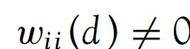

## 1 Overview

Local Measures of Spatial Autocorrelation (LMSA) focus on the **relationships between each observation and its surroundings**, rather than providing a single summary of these relationships across the map. In this sense, they are not summary statistics but scores that allow us to learn more about the spatial structure in our data.

The general intuition behind the metrics however is similar to that of global ones. Some of them are even mathematically connected, where the global version can be decomposed into a collection of local ones. One such example are **Local Indicators of Spatial Association (LISA)**. Beside LISA, **Getis-Ord’s Gi-statistics** will be introduce as an alternative LMSA statistics that present complementary information or allow us to obtain similar insights for geographically referenced data.

### Objectives

In this hands-on exercise, we will compute Local Measures of Spatial Autocorrelation (LMSA) by using [**sfdep**](https://sfdep.josiahparry.com/) package. We wil do the following:

-   import geospatial data using appropriate function(s) of **sf** package,
-   import csv file using appropriate function of **readr** package,
-   perform relational join using appropriate join function of **dplyr** package,
-   compute Local Indicator of Spatial Association (LISA) statistics for detecting clusters and outliers by using appropriate functions **sfdep** package;
-   compute Getis-Ord’s Gi-statistics for detecting hot spot or/and cold spot area by using appropriate functions of **sfdep** package; and to visualise the analysis output by using **tmap** package.

## 2 Getting started

### 2.1 The analytical question

In spatial policy, one of the main development objective of the local govenment and planners is to ensure equal distribution of development in the province. Our task in this study, hence, is to apply appropriate spatial statistical methods to **discover if development are evenly distributed geographically**. If the answer is **No**. Then, our next question will be [“is there sign of spatial clustering?”]{style="color: #B95E82;"}. And, if the answer for this question is **yes**, then our next question will be [“where are these clusters?”]{style="color: #B95E82;"}

In this case study, we are interested to examine the spatial pattern of a selected development indicator (i.e. GDP per capita) of Hunan Provice, People Republic of China.(https://en.wikipedia.org/wiki/Hunan)

### 2.2 Setting the Analytical Tools

We will use **sf**, **sfdep**, **tmap** and **tidyverse** packages of R.

| R package | Description |
|------------------------|-----------------------------------------------|
| sf | importing and handling geospatial data in R |
| tidyverse | wrangling attribute data in R |
| sfdep | compute spatial weights, global and local spatial autocorrelation statistics |
| tmap | prepare cartographic quality choropleth map |

The code chunk below is used to perform the following tasks:

-   creating a package list containing the necessary R packages,
-   checking if the R packages in the package list have been installed in R, if they have yet to be installed, RStudio will installed the missing packages,
-   launching the packages into R environment.

```{r}
pacman::p_load(sf, tidyverse, sfdep, spdep, tmap)
```

## 3 The data

### 3.1 The Study Area and Data

Two data sets will be used in this hands-on exercise, they are:

-   Hunan province administrative boundary layer at county level. This is a geospatial data set in ESRI shapefile format.

-   Hunan_2012.csv: This csv file contains selected Hunan’s local development indicators in 2012.

### 3.2 Import shapefile into R environment

The code chunk below uses [`st_read()`](https://r-spatial.github.io/sf/reference/st_read.html) of **sf** package to import Hunan shapefile into R. The imported shapefile will be **simple features** Object of **sf**.

```{r}
hunan <- st_read(dsn = "data/geospatial", layer = "Hunan") %>%
  st_transform(crs = 32650)
```

::::: markgoals
::: markgoals-header
**Tips**
:::

::: markgoals-container
The raw data is in WGS 84 geographic coordinates system. For geospatial analysis, it is appropriate to use projected coordinates system. In the code chunk above, `st_transform()` is used to transform Hunan geospatial data from WGS 84 to UTM zone 50N (i.e. EPSG: 32650).
:::
:::::

### 3.3 Import csv file into R environment

Next, we will import *Hunan_2012.csv* into R by using [`read_csv()`](https://readr.tidyverse.org/reference/read_delim.html) of **readr** package. The output is R data frame class.

```{r}
hunan2012 <- read_csv("data/aspatial/Hunan_2012.csv")
```

### 3.4 Performing relational join

Below we will update the attribute table of *hunan*’s SpatialPolygonsDataFrame with the attribute fields of *hunan2012* dataframe. This is performed using [`left_join()`](https://dplyr.tidyverse.org/reference/mutate-joins.html) of **dplyr** package.

```{r}
hunan <- left_join(hunan, hunan2012) %>%
  dplyr::select(1:4, 7, 15)
```

### 3.5 Visualising Regional Development Indicator

Now, we are going to prepare a basemap and a choropleth map showing the distribution of GDPPC 2012 using `qtm()` of **tmap** package.

```{r}
#| fig-width: 12
#| fig-height: 8

equal <- tm_shape(hunan) +
  tm_polygons(fill = "GDPPC",
              fill.scale = tm_scale_intervals(
                style = "equal",
                n = 5,
                values = "brewer.blues")) +
  tm_text("NAME_3", size = 0.5) +
  tm_borders(fiil_alpha = 0.5) + 
  tm_layout(legend.position = c("left", "bottom"), 
            main.title = "Equal interval classification")

quantile <- tm_shape(hunan) +
  tm_polygons(fill = "GDPPC",
              fill.scale = tm_scale_intervals(
                style = "quantile",
                n = 5)) +
  tm_text("NAME_3", size = 0.5) +
  tm_borders(fiil_alpha = 0.5) + 
  tm_layout(legend.position = c("left", "bottom"), 
            main.title = "Quantile classification")

tmap_arrange(equal, 
             quantile, 
             asp=1, 
             ncol=2)
```

::::: markgoals
::: markgoals-header
**Insights**
:::

::: markgoals-container
-   **Does the plot above reveal any outliers or clusters?**

    -   **outliers** - from both maps, we can see that county **Lengshuijiang** appears to be dark blue and is surrounded by lighter colors counties. **Zixing**, could also be considered as an outlier as most of the surrounding counties are lighter colors. Another outlier is **Anren** that appears to be the bottom of GDPPC but surrounded by higher GDPPC counties.

    -   **clusters** - We see clusters appearing in the Hunan province. In the northeast and southeast there is a high GDPPC cluster each. In central south from Xinhua to Tongdao counties, these form a low GDPPC cluster.

-   **Does the plot above indicate the presence of hot spots or cold spots?** Based on our observation for clusters:

    -   Hot spots include the clusters surrounding **Changsha** and **Guiyang**.
    -   Cold spot is the cluster from **Xinhua** to **Tongdao** that we identified for low GDPPC cluster.
:::
:::::

## 4 Local Indicators of Spatial Association(LISA)

Local Indicators of Spatial Association or LISA are statistics that evaluate the existence of clusters and/or outliers in the spatial arrangement of a given variable. For instance if we are studying distribution of GDP per capita of Hunan Provice, People Republic of China, local clusters in GDP per capita mean that there are counties that have higher or lower rates than is to be expected by chance alone; that is, the values occurring are above or below those of a random distribution in space.

In this section, we will apply appropriate Local Indicators for Spatial Association (LISA), especially local Moran’I to detect cluster and/or outlier from GDP per capita 2012 of Hunan Province, PRC.

### 4.1 Computing Contiguity Spatial Weights

Before we can compute the local spatial autocorrelation statistics, we need to construct a spatial weights of the study area. The spatial weights is used to define the neighbourhood relationships between the geographical units (i.e. county) in the study area.

In the code chunk below, [`st_contiguity()`](https://sfdep.josiahparry.com/reference/st_contiguity) of **sfdep** package is used to compute contiguity weight matrices for the study area. This function builds a neighbours list based on regions with contiguous boundaries. The “queen” argumenthas TRUE as default, meaning this function will return a list of first order neighbours using the Queen criteria.

Next, [`st_weights()`](https://sfdep.josiahparry.com/reference/st_weights) is used to calculate polygon spatial weights from the *nb* list.

`st_weights()` provides three arguments, they are:

-   nb: A neighbor list object as created by `st_neighbors()`.

-   style: Default “W” for row standardized weights. This value can also be “B”, “C”, “U”, “minmax”, and “S”. B is the basic binary coding, W is row standardised (sums over all links to n), C is globally standardised (sums over all links to n), U is equal to C divided by the number of neighbours (sums over all links to unity), while S is the variance-stabilizing coding scheme proposed by Tiefelsdorf et al. 1999, p. 167-168 (sums over all links to n).

-   allow_zero: If TRUE, assigns zero as lagged value to zone without neighbors.

```{r}
wm_q <- hunan %>%
  mutate(nb = st_contiguity(geometry),
         wt = st_weights(nb, style = "W"),
         .before = 1) 
```

**Check on the nb list:**

```{r}
summary(wm_q$nb)
```

::::: markgoals
::: markgoals-header
**Note**
:::

::: markgoals-container
The summary report above shows that there are **88 area units** in Hunan. The most connected area unit has **11 neighbour**s. There are two area units with only one neighbours.
:::
:::::

### 4.2 Row-standardised weights matrix

This step is about creating a spatial lag, which is a value that summarises the variable (like income) across a central area's immediate neighbors. The method chosen is to assign an equal weight to every neighboring area, known as style="W" (Row-Standardized Weights).

The weight for each neighbor is calculated simply as the fraction (/1number of neighbors). For example, if a county has four neighbors, each one is assigned a weight of 0.25. The final spatial lag is then computed by multiplying each neighbor's income value by this weight and summing the products. The primary appeal of this approach is that it is the most intuitive and easiest way to summarize the surrounding values.

The significant limitation of using the equal-weight style="W" is the "edge effect." Areas located along the boundaries of the study region naturally have fewer neighbors than those in the center.

When a polygon has fewer neighbors, those few neighbors receive a disproportionately large weight. This causes the calculated spatial lag for the boundary area to be heavily influenced by a limited sample of surrounding data, which may over or under-estimate the true underlying spatial pattern (spatial autocorrelation). Although this drawback exists, we use style="W" for its simplicity in this example. More robust alternative options—such as style="B" (Binary Weights) are available for more serious spatial analysis.

### 4.3 Computing local Moran’s I

To compute local Moran’s I, the [`local_moran()`](https://sfdep.josiahparry.com/reference/local_moran) function of **sfdep** will be used. It computes *Ii* values, given a set of *zi* values and a listw object providing neighbour weighting information for the polygon associated with the zi values.

The code chunks below are used to compute local Moran’s I of *GDPPC2012* at the county level.

```{r}
#| eval: false
set.seed(1234)
lisa <- wm_q %>% 
  mutate(local_moran = local_moran(
    GDPPC, nb, wt, nsim = 99),
         .before = 1) %>%
  unnest(local_moran)
write_rds(lisa, "data/rds/lisa.rds")
```

`local_moran()` function returns a matrix of values whose columns are:

-   Ii: the local Moran’s I statistics
-   E.Ii: the expectation of local moran statistic under the randomisation hypothesis
-   Var.Ii: the variance of local moran statistic under the randomisation hypothesis
-   Z.Ii:the standard deviate of local moran statistic
-   Pr(): the p-value of local moran statistic

```{r}
lisa <- read_rds("data/rds/lisa.rds")
head(lisa)
```

#### 4.3 Mapping the local Moran's I

::: panel-tabset
## Local Moran’s I values + p-values

Plotting the local Moran's I values and its correspnding p-values offers effective interpretation. **Individual plot is on the next tabs.**

```{r}
#| fig-width: 12
#| fig-height: 8
#| fig-align: center
ii.map <- tm_shape(lisa) +
  tm_polygons(fill = "p_ii_sim",
              fill.scale = tm_scale_intervals(
                style = "pretty",
                n = 5,
                values = "brewer.RdBu"),
              fill.legend = tm_legend(
                title = "Local Moran's I",
                position = tm_pos_in(
                  "left", "bottom"))) + 
  tm_text("NAME_3", size = 0.5) +
  tm_borders(fill_alpha = 0.5) +
  tm_title("Loal Moran's I of GDPPC (Queen's method)")

p_ii.map <- tm_shape(lisa) +
  tm_polygons(fill = "p_ii_sim", 
              fill.scale = tm_scale_intervals(
                breaks = c(-Inf, 0.001, 0.01, 0.05, 0.1, Inf),
                values = "-brewer.Reds"),
              fill.legend = tm_legend(
                title = "p-value",
      position = tm_pos_in("left", "bottom")
    )) + 
  tm_text("NAME_3", size = 0.5) +
  tm_borders(fill_alpha = 0.5) +
  tm_title("p-values of Loal Moran's I of GDPPC (Queen's method)")

tmap_arrange(ii.map, p_ii.map, asp=1, ncol=2)
```

## Local Moran’s I values

Using choropleth mapping functions of **tmap** package, we can plot the local Moran’s I values using the code chinks below.

```{r}
#| fig-align: center
tm_shape(lisa) +
  tm_polygons(fill = "p_ii_sim",
              fill.scale = tm_scale_intervals(
                style = "pretty",
                n = 5,
                values = "brewer.RdBu"),
              fill.legend = tm_legend(
                title = "Local Morans'I",
                position = tm_pos_out())) + 
  tm_text("NAME_3", size = 0.5) +
  tm_borders(fill_alpha = 0.5) +
  tm_title("Loal Morans'I of GDPPC (Queen's method)")
```

## Local Moran’s I p-values

The choropleth shows there is evidence for both positive and negative Ii values. However, it is useful to consider the p-values for each of these values, as consider above.

The code chunks below produce a choropleth map of Moran’s I p-values by using functions of **tmap** package.

```{r}
#| fig-align: center
tm_shape(lisa) +
  tm_polygons(fill = "p_ii_sim", 
              fill.scale = tm_scale_intervals(
                breaks = c(-Inf, 0.001, 0.01, 0.05, 0.1, Inf),
                values = "-brewer.Reds"),
              fill.legend = tm_legend(
                title = "p-value",
      position = tm_pos_out())) + 
  tm_text("NAME_3", size = 0.5) +
  tm_borders(fill_alpha = 0.5) +
  tm_title("p-values of Loal Moran's I of GDPPC (Queen's method)")
```
:::

### 4.4 Preparing and Visualising LISA Map

Visualizing LISA involves [creating maps that highlight significant spatial patterns, such as hot spots (high values clustered together) and cold spots (low values clustered together)]{style="color: #B95E82;"}, as well as identifying spatial outliers. Common methods include **choropleth maps** showing LISA values, **Moran scatterplots** which depict local spatial autocorrelation for individual locations, and hot spot analysis maps.

The LISA Cluster Map shows the significant locations color coded by type of spatial autocorrelation. The first step before we can generate the LISA cluster map is to [plot the Moran scatterplot]{style="color: #B95E82;"}.

#### 4.4.1 Plotting Moran scatterplot

A Moran Scatterplot is a graphical tool in spatial analysis that visualizes the relationship between a variable’s values and the average values of its neighboring locations (its spatial lag) to identify spatial autocorrelation. By plotting standardized values of the variable on the x-axis and its spatial lag on the y-axis, the plot’s slope represents Moran’s I, revealing patterns of high-high or low-low value clusters and high-low or low-high value outliers.

In the code chunk below, [`st_lag()`](https://sfdep.josiahparry.com/reference/st_lag) of **sfdep** package is used to calculates the spatial lag of GDPPC given a neighbor (i.e. nb) and weights list (i.e. wt).

```{r}
lisa <- lisa %>%
  mutate(lag_GDPPC = st_lag(
    GDPPC, nb, wt),
    .before = 1) %>%
  unnest(lag_GDPPC)
```

Then, the code chunk below is used to plot the Moran Scatterplot of GDPPC against its spatial lag version as shown in the code cunk below.

```{r}
#| fig-align: center
ggplot(data = lisa, 
       aes(x = GDPPC, 
           y = lag_GDPPC)) +
  geom_point() +
  geom_smooth(method = "lm", 
              se = FALSE, 
              color = "red") +
  labs(x = "GDPPC",
       y = "Spatial Lag of GDPPC",
       title = "Moran Scatterplot") +
  theme_minimal() +
  theme(panel.background = element_rect(fill = "#D0DDD0"),
        plot.background = element_rect(fill = "#D0DDD0"))
```

To support effective visual communication, we will plot to identify HH, HL, LH and LL using different colours.

```{r}
#| fig-slign: center
ggplot(data = lisa, 
       aes(x = GDPPC, 
           y = lag_GDPPC, 
           color = mean)) +
  geom_point(size = 1.5) +
  geom_smooth(method = "lm", 
              se = FALSE, 
              color = "black") +
  geom_hline(yintercept=mean(lisa$lag_GDPPC), lty=2) + 
    geom_vline(xintercept=mean(lisa$GDPPC), lty=2) +
  scale_color_manual(
    values = c("High-High" = "red", 
               "Low-Low" = "#5D866C",
               "Low-High" = "#96A78D", 
               "High-Low" = "pink")) +
  labs(x = "GDPPC",
       y = "Spatial Lag of GDPPC",
       title = "Moran Scatterplot with LISA Quadrants") +
  theme_minimal() +
  theme(panel.background = element_rect(fill = "#D0DDD0"),
        plot.background = element_rect(fill = "#D0DDD0"))
```

::::: markgoals
::: markgoals-header
**Note**
:::

::: markgoals-container
The plot is split in 4 quadrants. The top right corner belongs to areas that have high GDPPC and are surrounded by other areas that have the average level of GDPPC. This are the high-high locations in the in-class exercise 5.
:::
:::::

### 4.4.2 Plotting Moran scatterplot with standardised variable

First we will use [*scale()*](https://www.rdocumentation.org/packages/base/versions/3.6.2/topics/scale) to centers and scales the variable. Here centering is done by subtracting the mean (omitting NAs) the corresponding columns, and scaling is done by dividing the (centered) variable by their standard deviations.

```{r}
lisa <- lisa %>%
  mutate(z_GDPPC = scale(GDPPC),
         z_lag_GDPPC = scale(lag_GDPPC),
         .before = 1)
```

The [*as.vector()*](https://www.rdocumentation.org/packages/pbdDMAT/versions/0.5-1/topics/as.vector) added to the end is to make sure that the data type we get out of this is a vector, that map neatly into out dataframe.

Now, we are ready to plot the Moran scatterplot again by using the code chunk below.

```{r}
ggplot(data = lisa, 
       aes(x = z_GDPPC, 
           y = z_lag_GDPPC, 
           color = mean)) +
  geom_point(size = 1.5) +
  geom_smooth(method = "lm", 
              se = FALSE, 
              color = "black") +
  geom_hline(yintercept=mean(lisa$z_lag_GDPPC), lty=2) + 
    geom_vline(xintercept=mean(lisa$z_GDPPC), lty=2) +
  scale_color_manual(
    values = c("High-High" = "red", 
               "Low-Low" = "#5D866C",
               "Low-High" = "#96A78D", 
               "High-Low" = "pink")) +
  labs(x = "Standardised GDPPC",
       y = "Standardised Spatial Lag of GDPPC",
       title = "Standardised Moran Scatterplot with LISA Quadrants") +
  theme_minimal() +
  theme(panel.background = element_rect(fill = "#D0DDD0"),
        plot.background = element_rect(fill = "#D0DDD0"))

```

### 4.4.3 Preparing LISA map classes

The code chunks below show the steps to prepare a LISA cluster map.

Next, derive the spatially lagged variable of interest (i.e. GDPPC) and centers the spatially lagged variable around its mean. This is followed by centering the local Moran’s around the mean.

Next, we will set a statistical significance level for the local Moran.

```{r}
signif <- 0.05
```

### 4.4.4 Plotting and visualising LISA map

By default, the LISA classes are stored in *mean*, *median* and *pysal* fields of lisa sf data frame. To prepare the LISA map, we will derive a new field called LISA-cluster from either one of these three field by using the code chunk below.

```{r}
lisa <- lisa %>%
  mutate(
    LISA_cluster = ifelse(
      p_ii_sim < 0.05,
      as.character(mean), 
      "Insignificant"),
    LISA_cluster = factor(
      LISA_cluster,
      levels = c("Insignificant", "Low-Low", "Low-High", "High-Low", "High-High")
    )
  )
```

::::: markgoals
::: markgoals-header
**Note**
:::

::: markgoals-container
A new class called Insignificant has been added for records whereby p_ii \> 0.05.
:::
:::::

**Next we will plot the LISA map below:**

```{r}
#| fig-width: 12
lisa_map <- tm_shape(lisa) + 
  tm_polygons(
    fill = "LISA_cluster",
    fill.scale = tm_scale_categorical(
      values = c(
        "grey80",      # Insignificant
        "#5D866C",        # Low-Low
        "#96A78D",   # Low-High
        "pink",        # High-Low
        "red"          # High-High
      )
    ),
    fill.legend = tm_legend(
      title = "LISA Cluster",
      position = tm_pos_in("left", "bottom"))
  ) +
  tm_text("NAME_3", size = 0.5) +
  tm_borders() +
  tm_title("Local Moran's I Clusters (p < 0.05)")
lisa_map
```

Below we will plot both the local Moran’s I values map and its corresponding p-values map next to each other.

```{r}
#| fig-width: 12
#| fig-height: 8
#| fig-align: center
ii.map <- tm_shape(lisa) +
  tm_polygons(fill = "p_ii_sim",
              fill.scale = tm_scale_intervals(
                style = "pretty",
                n = 5,
                values = "brewer.RdBu"),
              fill.legend = tm_legend(
                title = "Local Moran's I",
                position = tm_pos_in(
                  "left", "bottom"))) + 
  tm_text("NAME_3", size = 0.5) +
  tm_borders(fill_alpha = 0.5) +
  tm_title("Loal Moran's I of GDPPC (Queen's method)")

lisa_map <- tm_shape(lisa) + 
  tm_polygons(
    fill = "LISA_cluster",
    fill.scale = tm_scale_categorical(
      values = c(
        "grey80",      # Insignificant
        "#5D866C",        # Low-Low
        "#96A78D",   # Low-High
        "pink",        # High-Low
        "red"          # High-High
      )
    ),
    fill.legend = tm_legend(
      title = "LISA Cluster",
      position = tm_pos_in("left", "bottom"))
  ) +
  tm_text("NAME_3", size = 0.5) +
  tm_borders() +
  tm_title("Local Moran's I Clusters (p < 0.05)")

tmap_arrange(ii.map, lisa_map, asp=1, ncol=2)
```

## 5 Hot Spots and Cold Spots Analysis (HCSA)

Hot spots and cold spots analysis is a technique used in spatial statistics to identify statistically significant clusters of high values (hot spots) and low values (cold spots) of a geographically referenced attribute (i.e. GDPPC). These analyses help visualize and understand spatial patterns, revealing areas where data points are clustered more densely than would be expected by random chance.

Figure below shows the hot spots and cold spots of GDP per capita of Hunan Provice, People Republic of China.

The term **hot spots** refer to areas where **high values are concentrated and surrounded by other high values**. It has been used generically across disciplines to describe a region or value that is higher relative to its surroundings (Lepers et al 2005, Aben et al 2012, Isobe et al 2015). For example, a hot spot analysis might reveal clusters of high GDP per capita in a province, indicating areas with significantly higher GDP per capita than other parts of the province.

The term **cold spots** refer to areas where **low values are concentrated and surrounded by other low values**. An example could be clusters of low GDP per capita, indicating areas where GDP per capita is consistently low.

HCSA uses statistical methods, like the Getis-Ord Gi\* statistic, to determine if the observed clustering is statistically significant or could have occurred randomly.

The analysis consists of four steps: 1. Deriving spatial weight matrix 2. Computing Gi\* statistics 3. Mapping Gi\* statistics 4. Communicating the analysis results

## 5.1 Deriving distance weight matrix

Whist the spatial autocorrelation considered units which shared borders, for Getis-Ord Gi\* statistics, we are defining neighbours based on distance.

There are two type of distance-based proximity matrix, they are:

-   fixed distance weight matrix,
-   adaptive distance weight matrix, and
-   inverse distance weights.

### 5.1.1 Computing fixed distance weights

In this section, we will compute fixed distance weight matrix by using `st_dist_band()` and `st_weights()` of **sfdep** package.

Firstly, we need to determine the upper limit for distance band by using the steps below:

```{r}
ct <- critical_threshold(st_geometry(hunan))
ct
```

The summary report shows that the largest first nearest neighbour distance is 60.80 km, so using this as the upper threshold gives certainty that all units will have at least one neighbour.

Using the critical threshold value computed above, code chunk below is used to compute the fixed distance weight.

```{r}
hunan_fdw <- hunan %>% 
  mutate(nb = include_self(
    st_dist_band(
      st_geometry(geometry), 
                 upper = ct)),
    wt = st_weights(nb, 
                      style = "W"),
    .before = 1) 
```

for Gi\* include_self() must be used to endure that {width="50"}.

### 5.1.2 Computing adaptive distance weights

One of the characteristics of fixed distance weight matrix is that more densely settled areas (usually the urban areas) tend to have more neighbours and the less densely settled areas (usually the rural counties) tend to have lesser neighbours. Having many neighbours smooth the neighbour relationship across more neighbours.

It is possible to control the numbers of neighbours directly using k-nearest neighbours, either accepting asymmetric neighbours or imposing symmetry as shown in the code chunk below.

In this section, you will learn how to compute fixed distance weight matrix by using `st_dist_band()` and `st_weights()` of **sfdep** package.

```{r}
hunan_adw <- hunan %>%
  mutate(nb = include_self(
    st_knn(
      st_geometry(geometry),
      k = 6)),
    wt = st_weights(
      nb, style = "W"),
    .before = 1)
```

## 5.2 Computing local Gi\*

Local Gi\* (pronounced “G-i-star”) is a Getis-Ord statistic used in spatial analysis to identify statistically significant hot spots and cold spots of high or low attribute values within a dataset. It measures the spatial clustering of values by comparing the total value within a specified neighborhood to the global total, producing a Z-score and p-value for each location to determine the likelihood that the observed pattern is not due to random chance.

In this sub-section, you will gain hands-on experience on performing Gi\* analysis by using `local_gstar_perm()` of **sfdep** package.

```{r}
HCSA_fdw <- hunan_fdw %>%
  mutate(
    gistar = local_gstar_perm(
      GDPPC, nb, wt, nsim = 99),
    .before = 1) %>%
  unnest(gistar)
```

## 5.3 Preparing and Visualising HCSA Map

::: panel-tabset

## Gi\* with fix distance weights

Thematic mapping functions of tmaps are used to prepare a choropleth map showing the distribution of Gi\* values.

```{r}
#| fig-widht: 12
#| fig-align: center
tm_shape(HCSA_fdw) +
  tm_polygons(fill = "gi_star",
              fill.scale = tm_scale_intervals(
                style = "pretty",
                n = 6,
                values = "brewer.rd_bu"),
              fill.legend = tm_legend(
                title = "Gi*",
                position = tm_pos_out())) + 
    tm_text("NAME_3", size = 0.4) +
  tm_borders(fill_alpha = 0.5) +
  tm_title("Gi* of GDPPC (Fixed Bandwidth d = 60799.91m)")
```

## Gi\* with fix distance weights

The choropleth shows there is evidence for both positive and negative Ii values. However, it is useful to consider the p-values for each of these values, as consider above.

The code chunk below plots a choropleth map of p-values of Gi\* by using functions of **tmap** package.

```{#| fig-width: 12}
tm_shape(HCSA_fdw) +
  tm_polygons(fill = "p_sim", 
              fill.scale = tm_scale_intervals(
                breaks = c(-Inf, 0.001, 0.01, 0.05, 0.1, Inf),
                values = "-brewer.Reds"),
              fill.legend = tm_legend(
                title = "simulated p-value",
      position = tm_pos_out())) + 
  tm_borders(fill_alpha = 0.5) +
  tm_title("p-values of local Gi* of GDPPC (Fixed distance)")
```

## Gi\* values + p-values

Plot both the Gi\* values map and its corresponding p-values map next to each other for more effective interpretation.

```{r}
#| fig-width: 12
Gi_star_map <- tm_shape(HCSA_fdw) +
  tm_polygons(fill = "gi_star",
              fill.scale = tm_scale_intervals(
                style = "pretty",
                n = 5,
                values = "-brewer.rd_bu"),
              fill.legend = tm_legend(
                title = "local Gi*",
                position = tm_pos_in(
                  "left", "bottom"))) + 
    tm_text("NAME_3", size = 0.4) +
  tm_borders(fill_alpha = 0.5) +
  tm_title("Local Gi* of GDPPC")

p_values_map <- tm_shape(HCSA_fdw) +
  tm_polygons(fill = "p_sim", 
              fill.scale = tm_scale_intervals(
                breaks = c(0, 0.001, 0.01, 0.05, 0.1, 1),
                values = "-brewer.reds"),
              fill.legend = tm_legend(
                title = "p-value",
      position = tm_pos_in("left", "bottom")
    )) + 
    tm_text("NAME_3", size = 0.4) +
  tm_borders(fill_alpha = 0.5) +
  tm_title("p-values of local Gi* of GDPPC (fixed distance)")

tmap_arrange(Gi_star_map, p_values_map, asp=1, ncol=2)
```

:::
## 5.4 Plotting and visualising HCSA Map

By default, the HCSA classes are stored in *cluster* field of *HCSA_fdw* sf data frame. To prepare the HSCA map, we will derive a new field called *HCSA_cluster* from *cluster* field using the code chunk below.

```{r}
HCSA_fdw <- HCSA_fdw %>%
  mutate(HCSA_cluster = case_when(
    p_sim > 0.05 ~ "Insignificant",
    p_sim <= 0.05 & cluster == "High" ~ "Hot spot",
    p_sim <= 0.05 & cluster == "Low"  ~ "Cold spot",
    TRUE ~ "Other"),
    HCSA_cluster = factor(
      HCSA_cluster,
      levels = c("Insignificant", "Hot spot", "Cold spot")
    ),
    .before = 1
  )
```

a new class called *Insignificant* has been added for records whereby p_sim \> 0.05.

**We will now plot the HCSA map:**

```{r}
#| fig-width: 12
#| fig-align: center
HCSA_map <- tm_shape(HCSA_fdw) + 
  tm_polygons(
    fill = "HCSA_cluster",
    fill.scale = tm_scale_categorical(
      values = c(
        "grey80",      # Insignificant
        "red",        # Low-Low
        "blue"          # High-High
      )
    ),
    fill.legend = tm_legend(
      title = "HSCA Cluster",
      position = tm_pos_in("left", "bottom"))
  ) +
    tm_text("NAME_3", size = 0.4) +
  tm_borders() +
  tm_title("HCSA Clusters (p < 0.05)")
HCSA_map
```
Next we will plot the local Gi* values map and its corresponding HCSA map next to each other for effective interpretation.
```{r}
#| fig-width: 12
tmap_arrange(Gi_star_map, HCSA_map, asp=1, ncol=2)
```


::::: markgoals
::: markgoals-header
**Insights**
:::

::: markgoals-container
We can observe from the LISA maps that:
-   There is stong spatial autocorrelation in eastern Hunan.
-   The hot spot cluster in the east shows that High GDPPC values surrounded by high GDPPC neighbors (High-High cluster) with statistically significance at p < 0.05. 
-   The code spot clusters appear in the northeastern area and central-south area with statistical significance. This shows persisten regional economic disadvantage. 
-   The grey areas show "insignificance", meaning that majority of the areas do not show statistically significant spatial clustering. 
:::
:::::

## 6 References
-   Kam, T. S. (2022, December 8). R for geospatial data science and analytics. https://r4gdsa.netlify.app/chap10#overview